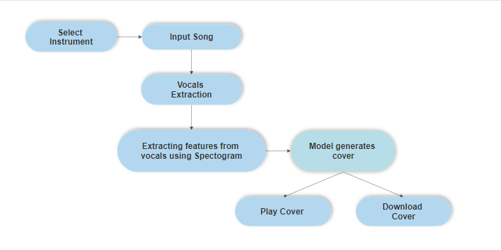
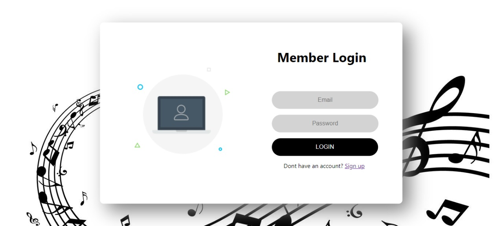
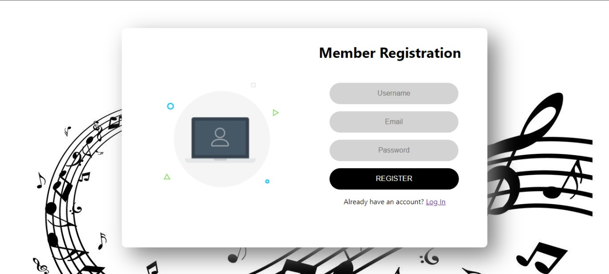
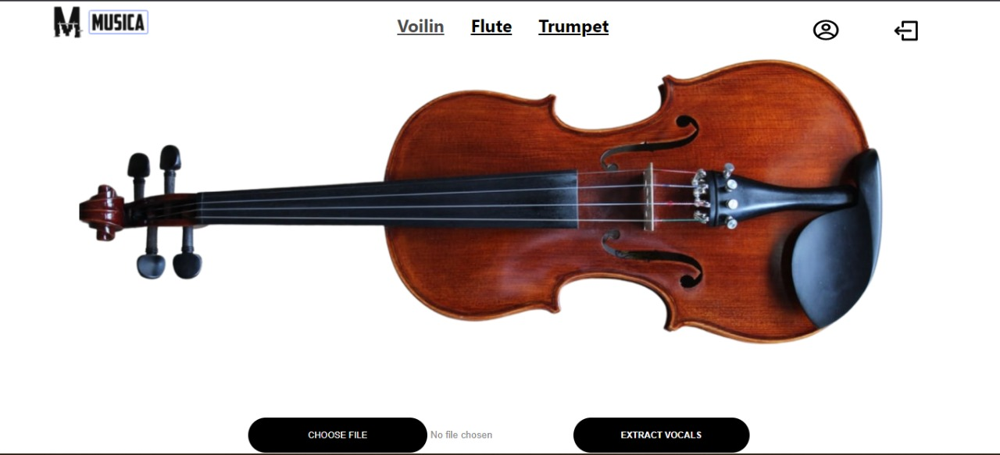

# Musica - A system for generating instrumental covers

- This project aims at filtering out the human vocals of songs using a library Spleeter, and turning them into instrumental versions, creating an ideal platform for young talented music enthusiasts to explore and learn to play various instruments. The vocals are converted to covers using the Differentiable Digital Signal Processing (DDSP) library, which enables direct integration of signal processing elements with deep learning techniques.
- Currently in the music industry, after recording original songs with lyrics, they are re-recorded for covers. AInstrument can also help music professionals and artists in turning existing songs to a particular instrumental cover to suit their need and also allows them to release various versions of their songs, without the burden of extra effort and money.

## Technology Stack
- Web Frontend developed using Reactjs
- Backend developed using FastAPI
- DDSP: Differentiable Digital Signal Processing
- Spleeter
- Data stored in Firebase

## User
- User Authenication using Firebase
- Separation of the human vocals from the lyrical songs.
- Conversion of the song into various instrumental covers with differently tuned parameters to provide the end users with various options.
- Figuring out the notes from the converted instrumental cover.
- Very robust and high fidelity audio synthesis system.
- This system will remove the dependency of the instrument learning process of callow students on musicians.

## Screenshots
### Flowchart 

### Login and Signup page

### Dashboard

## Steps to run the code
- Clone the repository to your local computer.
- Create a firebase project. [Need help!](https://cloud.google.com/firestore/docs/client/get-firebase)
- Create a ngrok account and get your unique access token.
- Open the frontend folder in the vscode or any editor of your choice and run the command `npm install` in the vscode terminal.
- Make a new file with the name '.env' in the root directory and add your firebase-config code in it.
- Now get to backend folder and upload both the files to two separate [Google Colab](https://colab.research.google.com) as it is.
- Add your firebase-config and Ngrok access token in both the colab notebooks and run all the cells (Make sure to change runtime, "spleeter_fastAPI_Backend.ipynb" should be working on None and "DDSP_implementation.ipynb" should be working on GPU).
- A server gets started and two Ngrok tunnels (eg. https://8ddc-34-86-245-109.ngrok.io/) will be created by both the files. Copy the Spleeter ngrok link and paste it in the folder '/Frontend/src/Components/Songprocessing.js' in the data variable in the 'handleSubmit' function.
- Now Copy the Spleeter ngrok link and paste it in the folder '/Frontend/src/Components/Songprocessing.js' in the data variable in the 'handleConvertSubmit' function.
- Save all the files and hit the commad `npm start` in the vscode terminal.
- Hurray! you are done with it now you can generate an instrumental cover of any song.

## Contact 
Please feel free to contact if you have any queries.
 
Email: shantanujc@gmail.com
